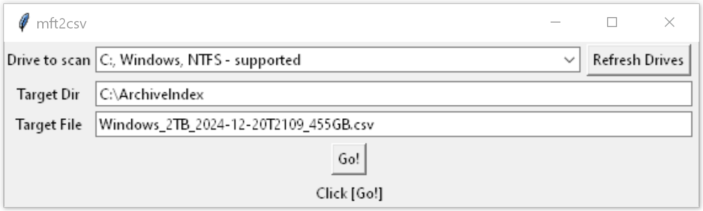

# mft2csv.pyw v.0.3

Create a list of files for a given NTFS drive, store the list as a csv file (tab-separated).

Lightweight and fast indexing of external and internal drives to know location of
backed-up or archived files on MS Windows.
Produces lists fast because it is reading MFT (NTFS metadata) instead of actually
fetching files from a drive.

Code location and updates: https://github.com/epolkovnikov/TinyTools/mft2csv/
Developed by Evgeny Polkovnikov, 2024
Thanks hansalemao for https://pypi.org/project/mft2df/

# Usage

The tool can be used in GUI or in CLI mode.

CLI call example:
    python mft2csv.pyw E
	  the output file name will be auto-generated,
	  the file will be put to the current working directory
    or
    pyrhon mft2csv.pyw E -o backup1.csv

GUI - *.pyw has to be associated with pythonw.exe, or use *.bat instead.

GUI in Administrator mode - needed mostly for internal NTFS drives.
    Right click on the mft2csv.bat file and select "Run as administrator"

Double click on the mft2csv.pyw or mft2csv.bat - mft2csv application window shall appear.
Put the drive letter.
If needed, adjust target/output dir and file (see the defaults below).

Input:
    Drive letter - e.g. E
        Please note: For internal drives, the script must be executed as Administrator
        External drives did not required elevated privileges

Output: Tab-separated csv text UTF-8 with the following fields:
    * rmd5 - md5 hash of the record (not the actual file!) for ease of finding duplicates
    * FileSize - file size in bytes
    * FileNameCreated - file creation timestamp
    * FileNameLastModified - file modification timestamp. FreeFileSync may leave it unset
    * FullPath - path to the file on the drive, the drive letter and the following / or \ are omitted
    Default file location is the current work directory of the script.
    Default file name is calculated as <drive label>_<drive size>_<current time stamp>_<free space>.csv

## Execution Requirements
Tested on MS Windows 11, Python 3.10.11. May also work on MS Windows 10
Exact Python requirements are listed in requirements.txt

## Design Considerations / Alternatives
[analyzeMFT](https://github.com/rowingdude/analyzeMFT) - actually requires an MFT dump file as input. That's an extra step, and an extra tool to find.

[pyMFTGrabber](https://github.com/jeffbryner/pyMFTGrabber) - the tool and lib to make the MFT dump. It turned out to be Python2, and legacy data types being used.
Also had an issue with win32 lib. Uninstalling/installing it - helped
pip uninstall pywin32
pip install pywin32
python c:\users\epeco\appdata\local\programs\python\python310\scripts\pywin32_postinstall.py

Yet, the tool requires network connection to post the resulting dump. - So 2 actions at least: start the netcat, execute the script. Too clunky for my scenario.

The MFT dump can be made with [mft_dump](https://github.com/omerbenamram/mft), - turned out it is already included in [mft2df](https://pypi.org/project/mft2df/)

